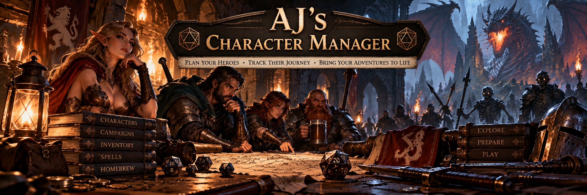

An open source character manager for D&D players, with offline rules support
and homebrew content creation.

> **Project status:** Phase 1 desktop prototype. The core campaign, character,
> and inventory workflow is runnable from source. There is no downloadable
> release yet, and packaged builds still need cross-platform acceptance testing.

AJ's Character Manager is planned as a desktop-first application that keeps
campaign and character data on the user's computer. The initial targets are
Windows x64 and macOS on Apple Silicon.

## Current prototype

- Campaigns with multiple characters
- Basic character fields, HP, and notes stored in local SQLite
- A party dashboard and editable character screen
- Searchable inventory with 15 manually reviewed SRD 5.2.1 weapons
- Separate reusable item definitions and character-owned inventory instances
- Inventory quantity and notes, including add, edit, and remove workflows
- A simple GUI creator for local custom items

Development is deliberately incremental. This prototype tests the desktop UI,
SQLite persistence, packaging configuration, and a small inventory workflow
before the project invests in a full rules engine or catalog. Phase 2 aims to
make the app useful during ordinary play. Phase 3 covers project maturation and
possible advanced features. See the [roadmap](docs/ROADMAP.md) for the exact
boundaries and completion criteria.

## Rules and custom content

The initial rules target is the current 2024 revision of fifth edition. SRD
5.2.1 is the redistribution foundation for bundled rules content. The project's
gameplay reference and redistribution authority have different roles; see
[Source of Truth](docs/SOURCE_OF_TRUTH.md).

Homebrew content is a first-class goal. Phase 1 supports local custom item
definitions. Later phases can expand GUI authoring and add portable content
packs when users have the rights to share them. Briarwood is planned as a Phase
2 example pack using the same generic tools available to everyone. It is not
application logic.

## Technology and platforms

The approved stack is Python 3.12, Flet, SQLite, uv, pytest, and Ruff. Windows
x64 and macOS Apple Silicon are the first packaging targets. Other platforms
remain possible future work.

## Run from source

### First-time setup

Install Python 3.12, then install
[uv](https://docs.astral.sh/uv/getting-started/installation/) once on your
computer:

```shell
brew install uv
```

Alternatively, use uv's official standalone installer:

```shell
curl -LsSf https://astral.sh/uv/install.sh | sh
```

Open a new terminal after installation and confirm that `uv --version` works.
From the repository directory, create the project environment and install the
locked dependencies:

```shell
uv sync --locked --group dev
```

`uv sync` creates or updates `.venv`; it does not need to be repeated for every
terminal session unless the dependency files change.

### Launch the app

From the repository directory, run:

```shell
uv run flet run src/main.py
```

If this checkout has already been synced but `uv` is temporarily unavailable
on your shell's `PATH`, launch the existing environment directly:

```shell
./.venv/bin/flet run src/main.py
```

The direct `.venv` command works only after the first-time dependency setup has
created that environment.

Application data is stored locally on the computer and the prototype does not
use accounts, networking, or cloud synchronization. The full development and
build workflow is described in [Development](docs/DEVELOPMENT.md).
Contributions are welcome; read [Contributing](CONTRIBUTING.md) before opening
an issue or pull request.

Additional documentation:

- [Architecture](docs/ARCHITECTURE.md)
- [Roadmap](docs/ROADMAP.md)
- [Custom content](docs/CUSTOM_CONTENT.md)
- [Content and licensing](docs/CONTENT_AND_LICENSING.md)
- [Security policy](SECURITY.md)

## Licensing and attribution

Original application code is licensed under the [MIT License](LICENSE). Rules,
structured data, example packs, and user content may have separate licenses;
see [Third-Party Notices](THIRD_PARTY_NOTICES.md) and
[Content and Licensing](docs/CONTENT_AND_LICENSING.md).

AJ's Character Manager is an independent, unofficial project and is not
affiliated with or endorsed by Wizards of the Coast.
